# Image classification
The goal of this project is to review various practices for the classification of images. 
Basically, these are the practices of fine tuning. Note that there is no need to use all of them at once, 
as presented here. However, if necessary, you can use the presented pipeline or its parts for similar tasks.

We implement the classifier for [Tiny ImageNet dataset](https://tiny-imagenet.herokuapp.com/) same as used in CS231N.
On this dataset, the classifier can be trained on a personal computer in a reasonable amount of time.
[PyTorch](https://pytorch.org/) framework is used for machine learning.

Before moving on, we note that to classify Tiny ImageNet you can use pretrained models without any architectural changes. To do this, you need to upsample Tiny ImageNet to the size of the images of the original dataset. The results may differ from the results with the original dataset, because when downsampling, details are lost.

## Overview
The Tiny ImageNet dataset spans 200 image classes with 500 training examples per class. 
The dataset also has 50 validation and 50 test examples per class. Image resolution is 64x64 pixels.
The dataset is derived from the original dataset using downsampling. 

A folder with a test dataset is not labeled. 
We use the words test and validation as interchangeable, since we do not work with them separately, 
but this is incorrect. For the [objectivity of the model](https://machinelearningmastery.com/difference-test-validation-datasets/), it is correct to conduct fine tuning on the validation dataset, and get the final result on the test dataset, which has not been used before.

The training set is small and contains low-resolution images, so overfitting can occur quite quickly during training.
However, there are practices that avoid fast overfitting and further improve accuracy. 

Best practices:
* Learning rate scheduling.\
Using a variable learning rate is useful for several reasons. If the learning rate is small, then the learning process 
may be too slow, and it is also possible to be in the local minimum of the loss function. If the learning rate is too 
large, then there is a chance of not converging at a minimum, or the algorithm diverges. In addition to the monotonous 
sheduling of changing the learning rate, there are [periodic](http://teleported.in/posts/cyclic-learning-rate/) 
shedulers, such as [cosine](https://arxiv.org/abs/1608.03983) and [triangular](https://arxiv.org/abs/1506.01186).
* Data augmentation. \
Augmentation allows you to modify the dataset with various transformations: rotation, translation, shearing, 
color change, cropping, flipping, etc. As a result, this artificially extends the dataset, and also makes the neural 
network more resistant to various distortions. Augmentations can also be used during inference followed by averaging 
of predictions.
* Label smoothing. \
One-hot classification is a general approach when training the classifier. 
With [label smoothing](https://arxiv.org/abs/1701.06548), all classes are given non-zero probability, and the target 
class has a probability of less than 1. As a result, correct neural network predictions do not reduce the loss 
function so much. This technique reduces the network’s confidence in its predictions, which will avoid overfitting 
and improve generalization.
* Freezing layers. \
If you want to train the classifier on new data, you can use the pretrained model by changing the output fully 
connected layer. Most likely, the first layers will not change, but later layers will change. Therefore, to speed up 
learning, you can freeze some of the first layers. This approach is effective if the models were trained on similar 
data, as well as if the pre-trained model was trained on large datasets.

If you built your own model for the first time and trained it first, then the first step is to check whether its 
architecture is able to solve your problem. To do this, try to train the model, for example, on one image. 
It is necessary that it can overfit. You can also roughly estimate the permissible learning rate on a 
very small subset of data.

List of useful sources:
* [Ideas on how to fine-tune a pre-trained model in PyTorch](https://medium.com/udacity-pytorch-challengers/ideas-on-how-to-fine-tune-a-pre-trained-model-in-pytorch-184c47185a20/)
* [A Comprehensive Hands-on Guide to Transfer Learning with Real-World Applications in Deep Learning](https://towardsdatascience.com/a-comprehensive-hands-on-guide-to-transfer-learning-with-real-world-applications-in-deep-learning-212bf3b2f27a)
* [8 Deep Learning Best Practices I Learned About in 2017](https://hackernoon.com/8-deep-learning-best-practices-i-learned-about-in-2017-700f32409512)
* [Label Smoothing: An ingredient of higher model accuracy](https://towardsdatascience.com/label-smoothing-making-model-robust-to-incorrect-labels-2fae037ffbd0)
* [Convolutional Neural Network Visualizations](https://github.com/utkuozbulak/pytorch-cnn-visualizations)

## Dataset
Among all classes, there are classes that are small objects. It will probably be difficult to recognize them after 
downsampling, so you should evaluate the size of the objects in the image.
To do this, you can use boxes whose parameters are specified in the folders with images.

Boxes of objects have different shapes, for example, a square for round or square objects, or an elongated 
rectangle for thin long objects. Therefore, a compromise solution is to estimate the proportion of boxing area to the 
area of the entire image.

Below are examples showing which part of the dataset images has a specified fraction of the area of the image area.

In the train dataset there are instances whose area is less than 1% of the total image area. One percent is an area of 
40 pixels, which roughly corresponds to a 6 by 6 pixel square box. In fact, the size of the object may be even smaller 
than the size of the box.

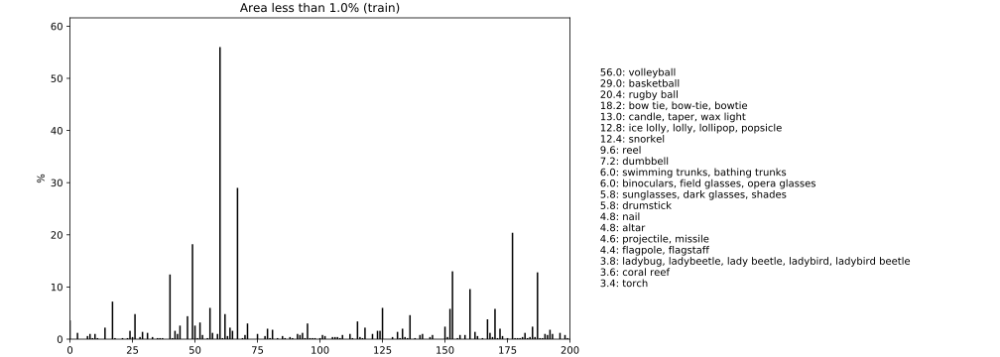

More than half of all *volleyball* class images have very small boxes. Other classes basically have not many small boxes.

The instances, whose area is less than 5% (box size of approximately 14 by 14 pixels), are larger. You can see that 
in 20 classes there is more than 20% of the dataset with small boxes.
For the top 40 classes in terms of the number of pictures with small boxes, the median of these pictures is 
approximately 19%. In other words, for 40 classes, approximately a fifth of the dataset contains small boxes.

Most likely, recognition of these 
objects will be more difficult than others. Also on the image may be other larger objects with which they can be confused.
It is possible that the classifier will use patterns that are not enclosed in boxes.

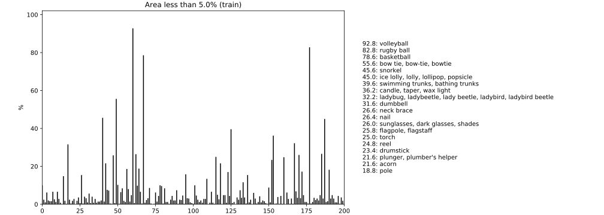

Pictures for areas less than 10% (box 20x20) and 20% (box 28x28) are presented below. These boxes are quite large.

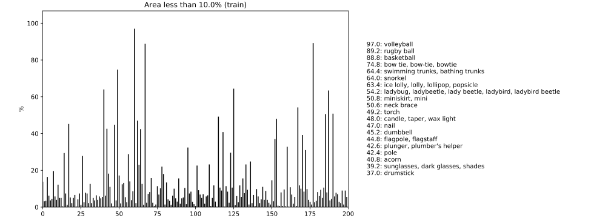
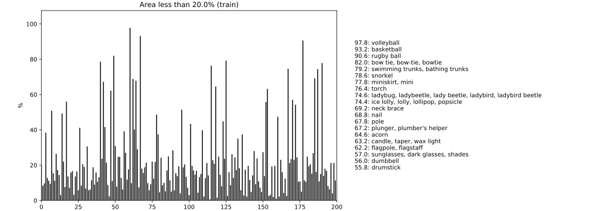

The size of the pictures and dataset, as well as the observations made, may motivate the following:
* It will be better to use convolutions with small kernels.
* The depth of the neural network is limited because the image has a low resolution.
* It is worth trying data augmentations and label smoothing.

## Utils
For reproducible results, fix the seeds (*fix_seed*). We will also prepare the pandas DataFrames with train and test 
sets and pass them to the dataset (*prepare_dataframes*). In the learning process, it can be convenient to 
observe how the loss changes. To do this, we will average the loss with each new batch (*AvgMoving*). In order to stop 
the learning process in time, we will calculate the accuracy on the validation set. If the accuracy does not increase 
over a certain number of epochs by a certain amount, then learning stops (*Stopper*).

## Augmentations
When training on such a small dataset, overfitting can occur quite quickly. Adding various transformations will allow 
us to artificially expand the data set. It is convenient to control the degree of augmentations. The degree of 
augmentation is set by a number from 0 (no augmentations) to 3 (heavy augmentations). For example `--aug_degree 0=0,
 10=1, 20=3` will lead to the fact that in the training dataset there will be no augmentations from 0 to 9 epoch, the 
 degree of augmentation is 1 from 10 to 19 epoch and the degree of augmentation is 3 from 20 epoch to the end of 
 training. Also, the greater the degree of augmentation, the greater the probability of using transformations. 
 
 Gradually enhancing augmentation can be helpful if you are learning from scratch or the accuracy on the validation 
 dataset stops growing.

List of augmentations:
* Horizontal flip;
* Crop and resize to previous size;
* Affine transforms (rotation, translation, scaling, shearing);
* Color jitter.

Hypothetically, label smoothing is necessary for heavy augmentations. Suppose your neural network has learned 
quite well, then you try to improve the result using augmentations.

For example, you have a picture in which a little cat and a big dog, and previously a neural network 
correctly determined that the picture belongs to the class *dog*. Suppose that as a result of augmentations, 
the dog almost disappeared from the image, and the cat became larger. The neural network will most likely 
consider that the image belongs to the *cat* class and will be right (in terms of human sense), however the 
image is still marked as the *dog* class. As a result of such a solution, the loss function will greatly 
increase and, as a result of optimization, it may begin to confuse these classes. But if you use label 
smoothing, then such augmentation will not be so critical for classifier.

## Classifier
The Сlassifier uses a neural network to classify images, and also has additional methods that are independent of a 
specific architecture. You can simply substitute other architectures.

## Architecture
[ResNet](https://arxiv.org/abs/1512.03385) is one of the popular and effective architecture for classifying images. 
Below is used ResNet18 whose fully connected output layer is adapted for a certain number of classes. A Dropout has 
been added before fully connected layer to avoid overfitting. 
To set probability in Dropout layer set `--prob_drop <value>`. 

You can use the classic pretrained ResNet18 (`--arch classic`). However, it is worth noting that when an 
image passes through ResNet18, it is compressed 5 times. Since the image size is 64x64, the size 
of the feature maps becomes very small (16x16 pixels at the input of 1 block and 4x4 pixels at the input of 4 blocks). 

To work at such a small resolution and retain spatial information, the source code of ResNet18 was taken and the strides in some convolutional layers 
were changed from 2 to 1 (`--arch custom`). Since only strides are changed, this also allows the use of weights of 
pretrained model. Also extra dropout layers was added before each convolution blocks (0.1, 0.1, 0.2, 0.3).

The dimensions of feature maps after passing through a layers are as follows:

| Layer                    | Classic ResNet18                  | Custom ResNet18                   |
|:------------------------ |:--------------------------------- |:--------------------------------- |
| image                    | 3 x 64 x 64                       | 3 x 64 x 64                       |
| conv_inp                 | 64 x 32 x 32                      | 64 x 64 x 64                      |
| maxpool                  | 64 x 16 x 16                      | 64 x 32 x 32                      |
| layer1                   | 64 x 16 x 16                      | 64 x 32 x 32                      |
| layer2                   | 128 x 8 x 8                       | 128 x 32 x 32                     |
| layer3                   | 256 x 4 x 4                       | 256 x 16 x 16                     |
| layer4                   | 512 x 2 x 2                       | 512 x 8 x 8                       |
| avgpool + flatten        | 512                               | 512                               |
| fc                       | 512 x 200                         | 512 x 200                         |

Stride was equal to 1 for layers *conv_inp* and *layer1*. As a result, there is no downsampling on these layers 
and the size of the feature map on the last convolution block is larger (8х8). If we used a classic ResNet18 
on original ImageNet data with cropping 224x224, then the size of the feature map would be 7x7 pixels.

When moving from *layer1* to *layer2*, no 
downsampling is performed. In this case, the repeated use of convolution artificially increases kernel size. In 
the article on [Inception](https://arxiv.org/abs/1512.00567), the researchers tried 
to preserve the large kernel by a sequence of convolutions with small kernels.

To train new classifier with pretrained neural network, you can freeze all layers except the output fully connected 
layer during the first few epochs. Then unfreeze some layers or all to continue learning. Parameter `--freeze <value>` allows you 
to freeze all layers except *k* last (layers, obtained by generator `model.children()`). For example `--freeze 0=1,
4=float("inf")` leads to freezing all layers except a fully connected layer from 0 to 3 epoch, and from 4 epoch to the 
end of the training all layers will be trained.

## Training
When training a neural network, SGD with 0.9 momentum and weight decay (`--weight_decay <value>`) is used as an optimizer. 

As a sheduler, cosine annealing 
with restart is used. Inspired by the results of the [article](https://arxiv.org/abs/1608.03983), the default is 
to double the restart period. The authors claim that using a short period (1-10 epochs) with a doubling of the period after each restart 
allows you to quickly train the neural network and even improve the result. It is worth noting that with each 
freezing and unfreezing of the layers, the sheduler restarts with basic learning rate and basic period. 
Use `--lr <value>` to set base learning rate, `--lr_min <value>` to set minimum learning rate 
and `--period_cosine <value>` to set basic period. If you set both learning rates equal, then the learning rate 
will be constant. Also you can set a large period to avoid restart and get a decreasing learning rate.

Cross entropy is used as a loss function.

Label smoothing has been added to the training process. For this, a modified cross entropy is used, which can 
use probability values less than 1. You can set the smoothing value by `--label_smooth <value>`. 
When setting zero, one-hot classification is used. Loss on a test dataset is always estimated using one-hot.

As you can see, many options are available for training. Many of them can be disabled or not used by 
setting the necessary values. It is likely that some of them will not make a big contribution to the 
learning outcomes on Tiny ImageNet, especially when using the pretrained model. However, 
if you train the classifier with the new architecture or train from scratch, then this baseline will be convenient.

## Visualization
Basic visualizations are loss and accuracy on the training and validation datasets for each epoch. Additionally, 
confusion matrix, examples of predictions, and bar charts with class accuracy are displayed at each epoch (top 20 
correctly predicted and top 20 incorrectly predicted classes).

Also, after the neural network is trained, it is possible to see which areas of the image make the greatest 
contribution to deciding whether or not to belong to any class. For this, various visualization methods are 
used: visualization of convolutional kernels, visualization of layer activation, calculation of gradients, guided 
backpropagation etc. 
Although they have high resolution, they are difficult to interpret. Another problem is that they are not 
class-discriminative.

[Gradient-weighted Class Activation Mapping](https://arxiv.org/abs/1610.02391) (Grad-CAM) is a visualization 
method that combines easy interpretability of the result, class-discriminative and high resolution.

Moreover, the method does not require a change in the architecture of the neural network and is very 
easy to integrate. To form an image, it is enough to obtain the values of activation and gradients 
after a certain layer. The most informative for the method are the activation of the last convolutional 
layer, which contain high-level semantic information. At the same time, the last layer should preserve spatial 
information, so it needs to have sufficient resolution of feature maps.

In PyTorch, values of gradients and activations after layers are not saved after propagation. 
However, they can be obtained during propagation by adding functionality to `forward` that extracts activations and 
gradients (with `register_hook`) into additional tensors.

Using this visualization method, one can get an “explanation” why a neural network chooses one or another 
class. To use the method, you need to specify a target class, however, if it is not specified, the one will selected 
based on classifier prediction. For example, if you have an image of the class *restaurant*, 
which also contains the classes *spoon*, *table*, *person*, etc., then you can specify these classes to make sure 
that the network also recognizes them on image.

To classify and visualize Grad-CAM for image, use `python predict.py`. As required arguments, you need to specify 
the path to the picture `--path_pic <value>`, as well as the path to the model weights `--path_weights <value>`. As an optional 
argument, you can specify the target class `--class <value>` and path to save the displayed image `--path_save <value>`. 
Custom architecture (`--arch custom`) is used as a model, therefore, loading weights should be for this model.

## Results
When using the pretrained model, it was possible to achieve a classifier accuracy of **72.86%** on 27 epoch.
For a classifier trained from scratch, accuracy reached **55.7%**.
The accuracy of classic ResNet18 for the original ImageNet is **72.12%** with 10 crop-testing.

Both classifier presented in the *results* folder were trained with the following parameters:

```
--lr 1e-2 \
--lr_min 5e-4 \
--batch_size 400 \
--aug_degree 0=2 \
--freeze 0=float("inf") \
--prob_drop 0.2 \
--weight_decay 5e-5 \
--period_cosine 1 \
```

When changing the parameters, the maximum accuracy usually deviated within 2% percent. However, 
the convergence rate can vary significantly. For example, a pretrained classifier can be trained to an 
accuracy of **70.82%** in just 6 epoch, if you do not use augmentations, increase base learning rate to 0.05 and freeze layers up to 3 epochs.

A gradual increase in augmentation also allows you to generalize model, but it does not bring 
significant improvements to the accuracy of the prediction on Tiny ImagNet.
When setting augmentations equal to 3, the maximum accuracy decreases and cannot rise to accuracy with augmentations equal to 2.

Accuracy on train and validation datasets:

|                   |                                           |
|:----------------- |:------------------------------------------|
|  From scratch     |  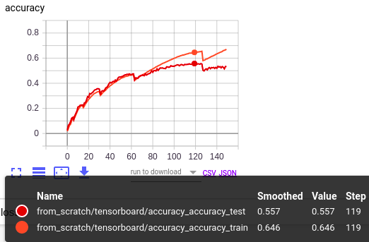     |
|  Pretrained       |  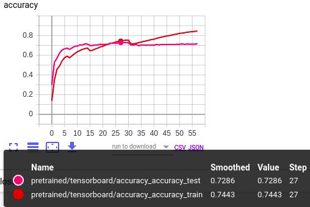       |
|  Quick pretrained |  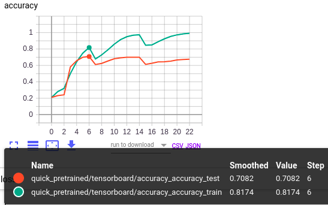 |

Bar charts with top 20 correctly predicted classes: 

|                   |                                           |
|:----------------- |:------------------------------------------|
|  From scratch     |  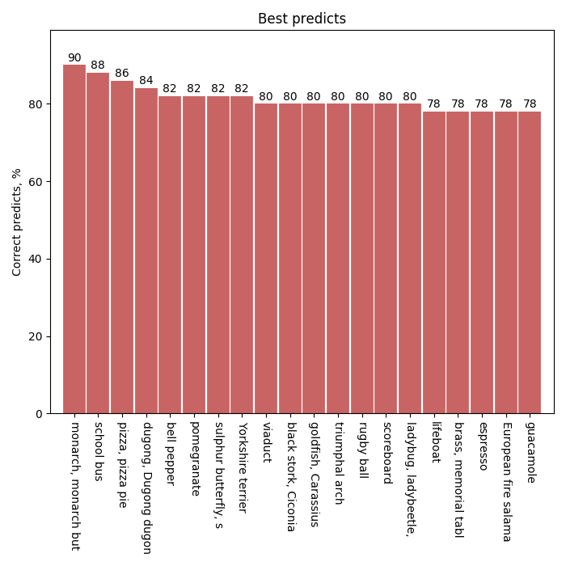     |
|  Pretrained       |  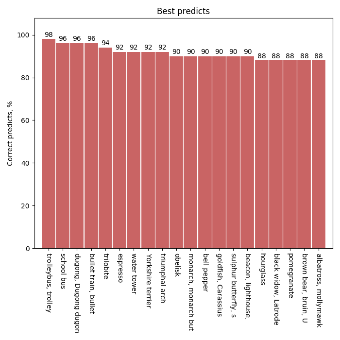       |
|  Quick pretrained |  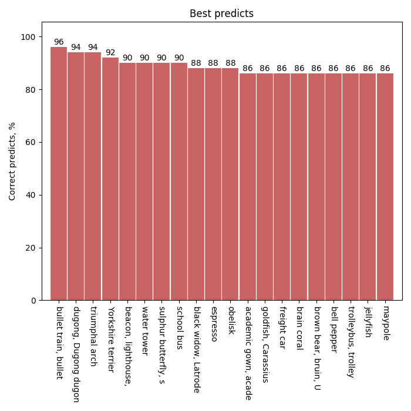 |


Bar charts with top 20 incorrectly predicted classes: 

|                   |                                            |
|:----------------- |:-------------------------------------------|
|  From scratch     |  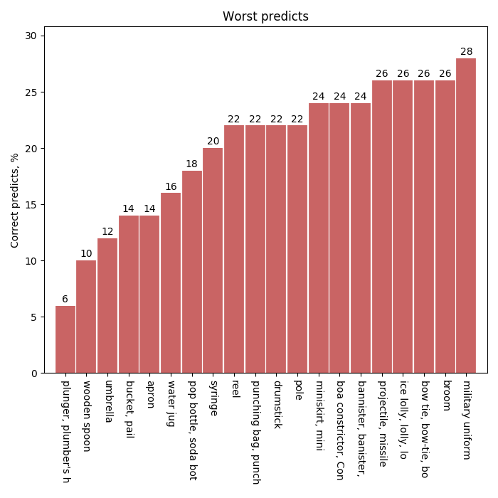     |
|  Pretrained       |  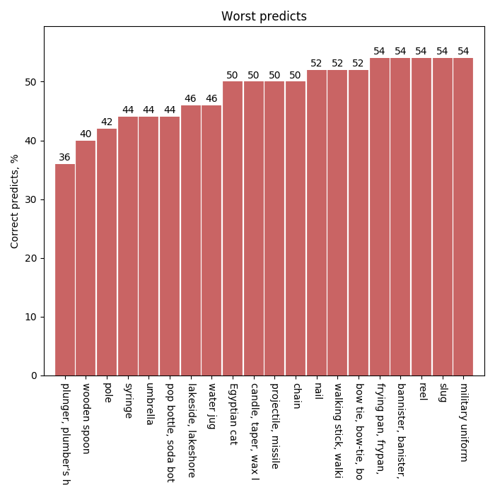       |
|  Quick pretrained |  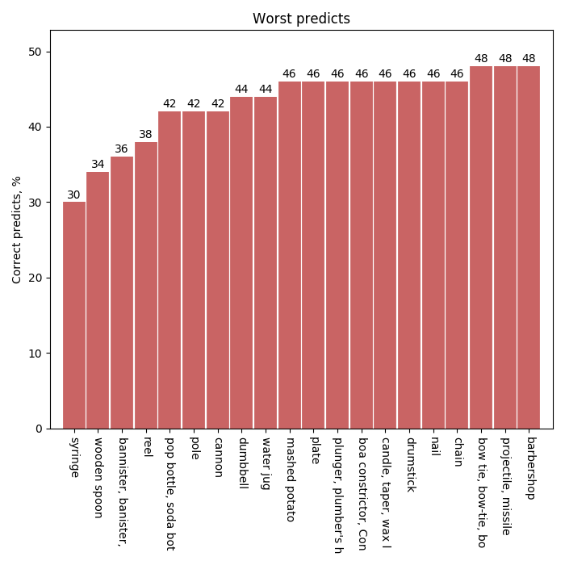 |

As you can see, there are several classes that all three classifiers predict almost equally well. 
However, for a network trained from scratch, the top 20 incorrect predicted classes have low accuracy (no more than 28%). 
Basically, these classes are represented by small or thin objects. The other two networks also have problems 
with these classes, but their accuracy is significantly higher.

Let's consider some resuts of predictions with Grad-CAM.

The following are examples of correct predictions.

|                          |                          |
|:------------------------ |:-------------------------|
|  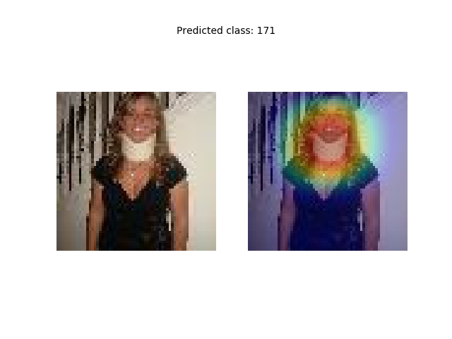 |  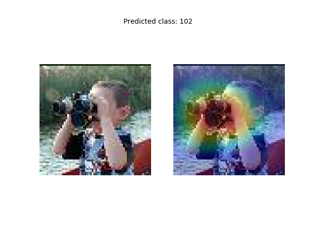 |

If the class is represented by several instances, then both of them are recognized.

|                          |                          |
|:------------------------ |:-------------------------|
|  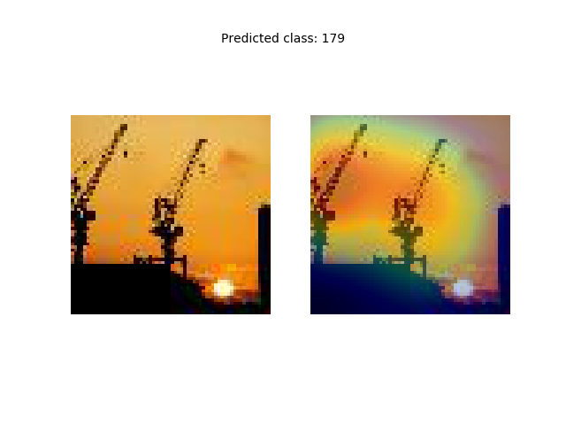 |  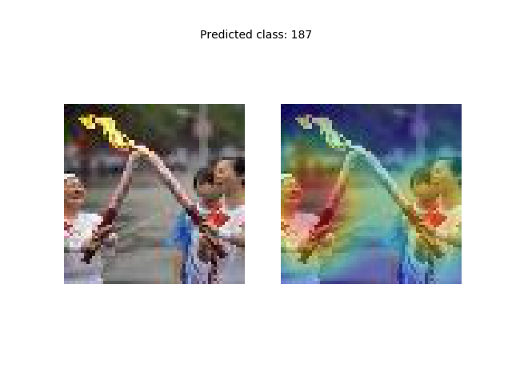 |

Let's look at some wrong predictions. For example, in a test dataset, an image *val_453* has an incorrect prediction. 
The neural network predicted class *lakeshore* (61), although the correct class is *suspension bridge* (70). 
Both classes are presented in the image.
If we calculate the map for class 70, we see that the neural network also still recognizes the bridge.

|                          |                          |
|:------------------------ |:-------------------------|
|  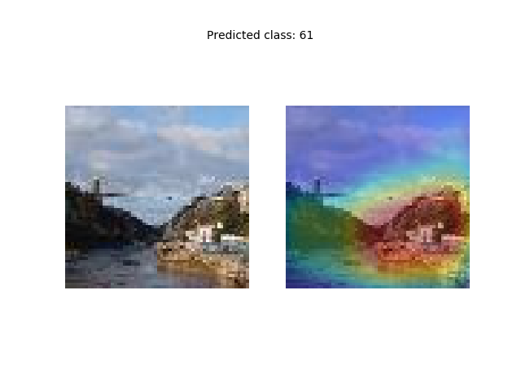  | 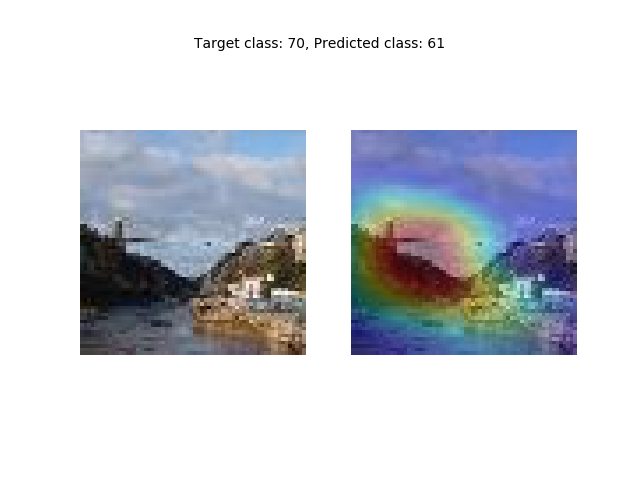 |

In the following example, there are also two classes *German sheferd* (81) and *apron* (22).
The target class is 22, and the prediction corresponds to 81.

|                          |                          |
|:------------------------ |:-------------------------|
|  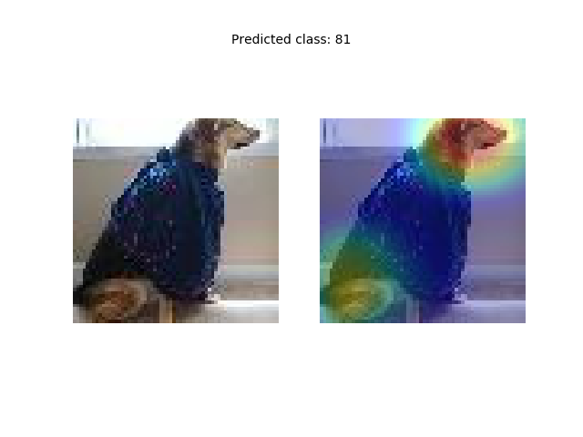 | 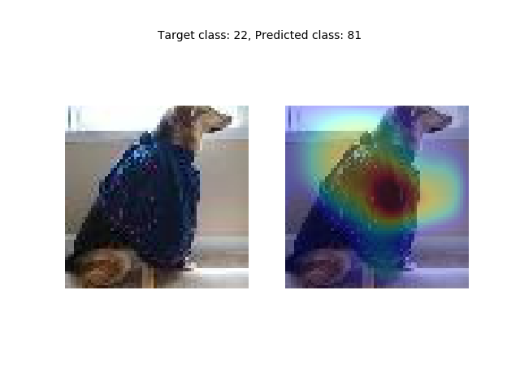|

There is also a type of errors when a neural network correctly detects an object, but cannot correctly 
recognize it. In the following example, the object is recognized as a *picket fence* (169), but it is marked as a *space heater* (40). 
They are really hard to distinguish. For example, if the monochrome background was not gray, but blue, 
then a person would probably think that this is a fence. However, a gray background is associated more with 
a wall than with a cloudy sky. Another possible reason is that there could be a lot of electric heaters 
in the training dataset that did not look like a fence.

|                          |                          |
|:------------------------ |:-------------------------|
| 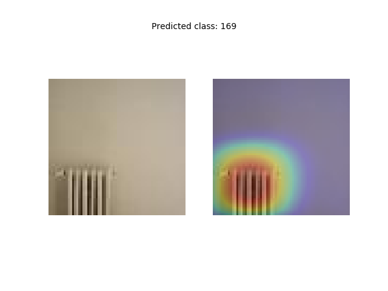 | 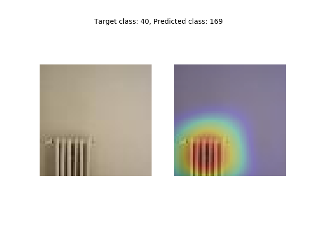 |

There are classes in the dataset that are not a physical object, but are a 
phenomenon or event. For example, *basketball* (51). Most likely, basketball should be associated with the ball in terms 
of human sense. 

However, the neural network almost never uses a ball in its decisions. It is very likely that 
this is an unreliable pattern, because it has a very low resolution, and can also be confused with other 
classes in which the ball is present. The most important pattern is the player. Presumably, this choice is 
based on the specific form of clothing of basketball players.

|                         |                         |
|:----------------------- |:------------------------|
| 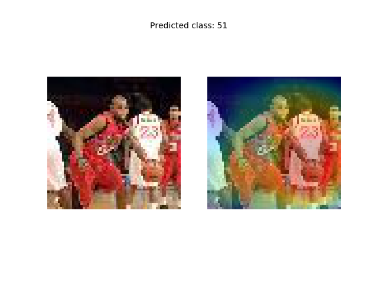  | 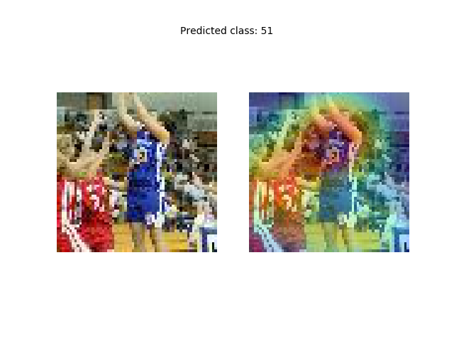  |
| 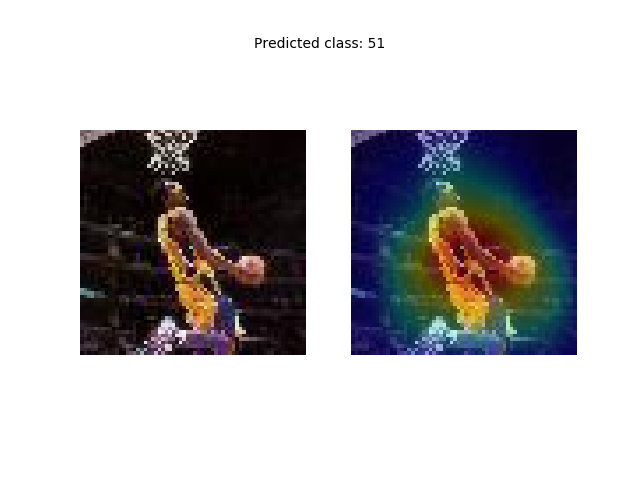 | 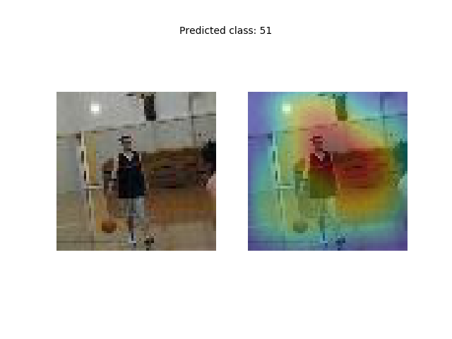 |
| 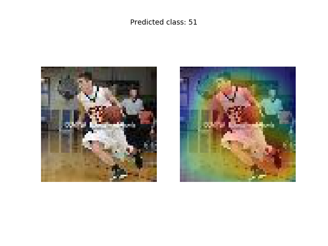 | 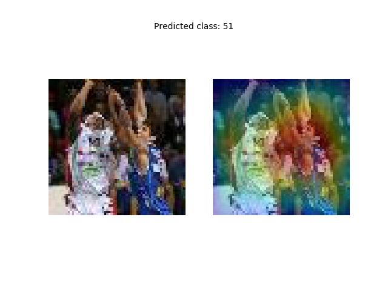 |
| 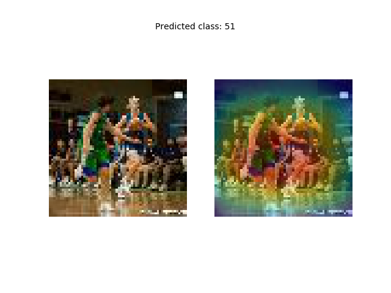 | 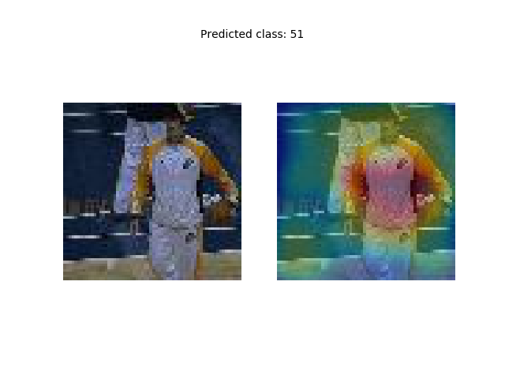 |

Also note that the dataset must contain a training, validation, and test subset. At the same time, the 
test dataset in the Tiny ImageNet is not labeled. So you could use the labeled validation dataset for the test, 
and split training dataset into new training and validation subset for fine-tuning (also you can use cross-validation). 
However, this did not work out, so it is expected that the accuracy on the new test dataset may be lower.
